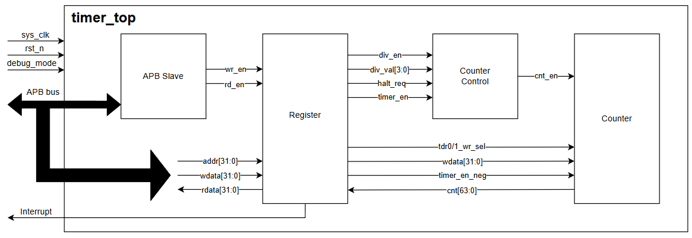

# Timer IP — 64-bit APB Timer (RISC-V CLINT-style)

A synthesizable 64-bit up-counting timer IP with an APB slave interface, written in
Verilog-2001. The register set is customized from the CLINT block of a RISC-V SoC and
generates a maskable, level-sensitive interrupt when the counter matches a 64-bit
compare value.

This repository implements the **advanced level** of the final project of the ICTC course
*IC Overview — RTL Design and Verification*: 1-cycle wait state, byte-enable writes,
APB error response and halt-in-debug-mode support.

---

## Features

- 64-bit up counter, free running while interrupts or overflow occur
- APB slave interface, 12-bit address space, 32-bit data
- Counting rate controlled by register settings: system clock rate, or one count every
  2/4/8/…/256 clock cycles
- Maskable, level-sensitive timer interrupt with a write-1-to-clear status bit
- Active-low asynchronous reset
- **Byte access**: individual byte lanes of a register can be written through `tim_pstrb`
- **Wait state**: one wait cycle is inserted on every APB transfer (`tim_pready`)
- **Error response**: `tim_pslverr` is asserted on prohibited configuration writes, and the
  register is left unchanged
- **Halt in debug mode**: the counter freezes while a halt request is pending and the core
  is in debug mode, then resumes from the value it was stopped at

Note: `div_en` / `div_val` are **not** a clock divider. The IP runs entirely on `sys_clk`;
these fields only decide *how often* the counter is allowed to increment.

---

## Block diagram



| Module | File | Role |
|---|---|---|
| `timer_top` | `rtl/timer_top.v` | Top level, wiring and address concatenation |
| `apb_slave` | `rtl/apb_slave.v` | APB protocol handling, generates `wr_en`/`rd_en` and `pready` |
| `register` | `rtl/register.v` | Register file, address decode, byte strobes, error detection, read mux |
| `counter_control` | `rtl/counter_control.v` | Internal prescale counter, generates `cnt_en`, applies halt |
| `counter` | `rtl/counter.v` | 64-bit counter, software load from TDR0/TDR1 |

---

## IO port list

Top module: `timer_top`

| Signal | Width | Direction | Description |
|---|---|---|---|
| `sys_clk` | 1 | input | System clock |
| `sys_rst_n` | 1 | input | Asynchronous reset, active low |
| `tim_psel` | 1 | input | APB select |
| `tim_pwrite` | 1 | input | APB write (1) / read (0) |
| `tim_penable` | 1 | input | APB enable, marks the access phase |
| `tim_paddr` | 12 | input | APB address (register offset) |
| `tim_pwdata` | 32 | input | APB write data |
| `tim_prdata` | 32 | output | APB read data |
| `tim_pstrb` | 4 | input | APB write strobe, one bit per byte lane |
| `tim_pready` | 1 | output | APB ready, low for one cycle to insert a wait state |
| `tim_pslverr` | 1 | output | APB slave error |
| `tim_int` | 1 | output | Timer interrupt, level sensitive |
| `dbg_mode` | 1 | input | High when the system is in debug mode |

The top level concatenates `tim_paddr` with a fixed upper field, so the IP is decoded at
base address `0x4000_1000`; register selection itself uses the lower 12 bits only.

---

## Register map

| Offset | Name | Description |
|---|---|---|
| `0x00` | TCR | Timer Control Register |
| `0x04` | TDR0 | Timer Data Register 0 (counter bits 31:0) |
| `0x08` | TDR1 | Timer Data Register 1 (counter bits 63:32) |
| `0x0C` | TCMP0 | Timer Compare Register 0 (compare bits 31:0) |
| `0x10` | TCMP1 | Timer Compare Register 1 (compare bits 63:32) |
| `0x14` | TIER | Timer Interrupt Enable Register |
| `0x18` | TISR | Timer Interrupt Status Register |
| `0x1C` | THCSR | Timer Halt Control / Status Register |
| others | — | Reserved: reads return 0, writes are ignored |

### TCR — `0x00`, reset `0x0000_0100`

| Bits | Field | Type | Reset | Description |
|---|---|---|---|---|
| 31:12 | reserved | RO | `20'h0` | — |
| 11:8 | `div_val` | RW | `4'b0001` | Counting rate. `0` = every clock, `1` = every 2 clocks, `2` = every 4, … `8` = every 256. Values above `8` are prohibited |
| 7:2 | reserved | RO | `6'b0` | — |
| 1 | `div_en` | RW | `1'b0` | `0` = counter runs at clock rate, `1` = counter rate follows `div_val` |
| 0 | `timer_en` | RW | `1'b0` | `1` starts the counter. A `1`→`0` transition clears the counter and TDR0/TDR1 back to their initial value |

Writing `div_en` or `div_val` while `timer_en` is high, or writing a prohibited `div_val`,
returns an error response and leaves the field unchanged.

### TDR0 / TDR1 — `0x04` / `0x08`, reset `0x0000_0000`

Lower and upper halves of the 64-bit counter. Readable at any time and writable to preload
the counter. Both are cleared when `timer_en` goes from high to low.

### TCMP0 / TCMP1 — `0x0C` / `0x10`, reset `0xFFFF_FFFF`

Lower and upper halves of the 64-bit compare value. The interrupt condition is
`{TCMP1, TCMP0} == counter`.

### TIER — `0x14`, reset `0x0000_0000`

| Bits | Field | Type | Reset | Description |
|---|---|---|---|---|
| 31:1 | reserved | RO | `31'h0` | — |
| 0 | `int_en` | RW | `1'b0` | Interrupt enable. Clearing it while the interrupt is asserted masks `tim_int` but does not clear `TISR.int_st` |

### TISR — `0x18`, reset `0x0000_0000`

| Bits | Field | Type | Reset | Description |
|---|---|---|---|---|
| 31:1 | reserved | RO | `31'h0` | — |
| 0 | `int_st` | RW1C | `1'b0` | Interrupt pending. Set when the counter matches the compare value, cleared by writing `1`. Writing `0` has no effect. The counter keeps counting after the match |

### THCSR — `0x1C`, reset `0x0000_0000`

| Bits | Field | Type | Reset | Description |
|---|---|---|---|---|
| 31:2 | reserved | RO | `30'h0` | — |
| 1 | `halt_ack` | RO | `1'b0` | `1` when the halt request has been accepted, i.e. `halt_req` is set and `dbg_mode` is high |
| 0 | `halt_req` | RW | `1'b0` | Halt request. Clearing it resumes counting |

---

## Functional description

### Counting

With `div_en = 0` the counter increments on every clock. With `div_en = 1` an internal
prescale counter in `counter_control` counts to `2^div_val - 1` and issues one `cnt_en`
pulse per period, so the counter advances once every `2^div_val` clocks. `div_val = 0` in
control mode behaves like the default mode.

### Interrupt

`tim_int` is asserted while the interrupt is enabled and the pending bit is set. The
pending bit is set on a compare match and stays set until software writes `1` to
`TISR.int_st`. Disabling `TIER.int_en` masks the output without clearing the pending bit.

### Halt

While `halt_req` is set and `dbg_mode` is high, the prescale counter holds its value and
`cnt_en` is suppressed, so the counter freezes. When the request is cleared the prescale
counter continues from where it stopped, which keeps the period of every counting step the
same across the halt boundary.

### APB accesses

- Every transfer takes one wait state: `tim_pready` rises one cycle after `psel & penable`.
- On writes, `tim_pstrb` selects which byte lanes are updated. TDR0/TDR1/TCMP0/TCMP1 use
  all four lanes; the control and status registers only have fields in the lowest bytes.
- Reads of reserved offsets return `0`; writes to them are ignored.
- `tim_pslverr` is asserted for the prohibited configuration writes listed under TCR. The
  targeted register bits keep their previous value in that case.

---

## Repository layout

```
.
├── rtl/                  # synthesizable RTL
│   ├── timer_top.v
│   ├── apb_slave.v
│   ├── register.v
│   ├── counter_control.v
│   └── counter.v
├── testcases/            # one file per testcase, copied to run_test.v by the Makefile
├── sim/
│   ├── Makefile          # Xcelium + SimVision + QuestaSim coverage flow
│   ├── compile.f         # file list passed to the compiler
│   └── test_bench.v      # testbench top
├── doc/                  # design spec, verification plan
└── README.md
```

---

## Simulation

| Purpose | Tool |
|---|---|
| Compile and simulate | Cadence Xcelium (`xrun`) |
| Waveform viewing | SimVision |
| Code coverage | Siemens QuestaSim (`vlog +cover` / `vsim -coverage` / `vcover`) |

All commands are run from `sim/`.

```bash
# compile + elaborate, then simulate
make TESTNAME=<testcase> all

# simulate with an SHM waveform dump and open SimVision
make TESTNAME=<testcase> all_wave

# interactive debug on the elaborated snapshot
make gui

# coverage build and run (QuestaSim)
make TESTNAME=<testcase> all_cov

# merge coverage databases and generate reports
make gen_cov     # text report under coverage/
make gen_html    # html report

make clean
make help
```

Useful variables: `TESTNAME` (testcase file name without extension), `TB_NAME` (testbench
top module), `FILELIST` (compile file list), `WAVE_DB` (waveform database name).

## References

- CLINT specification used as the starting point for the register set:
  <https://chromitem-soc.readthedocs.io/en/latest/clint.html>
- AMBA APB protocol specification (ARM IHI 0024)

## Acknowledgement

Design specification adapted from the final project of the ICTC training center course
*IC Overview — RTL Design and Verification*.
